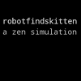
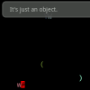

# robotfindskitten

This is an Android implementation of
[robotfindskitten](http://robotfindskitten.org).

## Download

  * [robotfindskitten (Google Play)](https://play.google.com/store/apps/details?id=info.staticfree.android.robotfindskitten)
  * [robotfindskitten.apk](robotfindskitten.apk) (same as the one published on Play)

## Changes

  * 2012-12-21: 1.0.701 - Mayan Apocalypse Edition; a slew of new NKI, tablet support, new old-style theme, updated icon
  * 0.9.406 - Fixed non-shown messages; updated icon
  * 0.8.406 - fixed multi-density scaling; minor visual improvements
  * 0.7.406 - added QVGA support
  * 0.6.406 - added touchscreen support; moved toward RFK RFC compliance.

## Screenshots

  * 
  * 
  * 

## Source

The source for Android robotfindskitten is available via the [Android
robotfindskitten git
repository](https://github.com/xxv/robotfindskitten). You can grab a
copy for yourself by running:

    git clone https://github.com/xxv/robotfindskitten.git

### License

The code is made available under the GPL v3

### Thanks!

### Credits

  * Icon artwork by [Sarah Morrison](http://tashari.org/)

