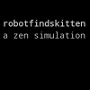
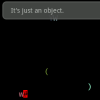

# robotfindskitten

This is an Android implementation of
[robotfindskitten](http://robotfindskitten.org).

## Download

  * [robotfindskitten (Google Play)](https://play.google.com/store/apps/details?id=info.staticfree.android.robotfindskitten)
  * [robotfindskitten.apk](robotfindskitten.apk) (same as the one published on Play)

## Changes

  * 1.1.0 - Modernized build (Gradle); targets current Android versions
  * 2012-12-21: 1.0.701 - Mayan Apocalypse Edition; a slew of new NKI, tablet support, new old-style theme, updated icon
  * 0.9.406 - Fixed non-shown messages; updated icon
  * 0.8.406 - fixed multi-density scaling; minor visual improvements
  * 0.7.406 - added QVGA support
  * 0.6.406 - added touchscreen support; moved toward RFK RFC compliance.

## Screenshots

  * 
  * 
  * 

## Source

The source for Android robotfindskitten is available via the [Android
robotfindskitten git
repository](https://github.com/xxv/robotfindskitten). You can grab a
copy for yourself by running:

    git clone https://github.com/xxv/robotfindskitten.git

### Building

The app builds with Gradle. You'll need JDK 17 or newer (the one bundled with
Android Studio works) and the Android SDK. Either open the project in Android
Studio, or run:

    ./gradlew assembleDebug

To build a signed release bundle for Google Play, create a
`keystore.properties` file in the project root (it's ignored by git):

    storeFile=/path/to/upload-key.jks
    storePassword=...
    keyAlias=...
    keyPassword=...

Then run:

    ./gradlew bundleRelease

The bundle ends up in `app/build/outputs/bundle/release/app-release.aab`.

### License

The code is made available under the GPL v3

### Thanks!

### Credits

  * Icon artwork by [Sarah Morrison](http://tashari.org/)

### Privacy Policy

This app doesn't collect any information about its usage and has no Internet connectivity. Enjoy!
See the full [privacy policy](PRIVACY.md) for details.

